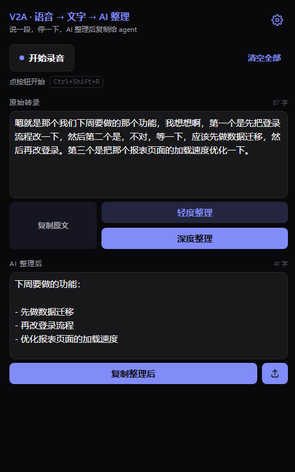

<div align="center">

# V2A for Windows

**说一段话 → 实时转成文字 → AI 整理通顺 → 复制给 ChatGPT / Claude / 任何 Agent**

打字慢的时候用。自带 key，没有后端，不收集任何数据。

<sub>*Speak, get clean agent-ready text. Real-time transcription via Soniox plus the AI provider of your
choice for cleanup. Bring your own keys — no backend, no account, no telemetry.
The app itself is bilingual (中文 / English).*</sub>



</div>

---

## 它解决什么问题

跟 AI agent 打交道时，想说的话往往比能打出来的多。但直接把语音转录粘过去又很难用 ——
口语里全是「嗯」「那个」「不对等一下」，还有说到一半改口。

V2A 把这一段补上：**转录之后再让 AI 按你定的规则整理一遍**。上面截图里就是个真实例子 ——
说话人中途改了主意（「先改登录，不对，应该先做数据迁移」），深度整理直接按最终意思
输出成了有序的 bullet。

---

## 项目状态

**v1.0 尚未发布**，Releases 页面还是空的。现在只能[从源码运行](#方式三从源码运行)。

已经能用：录音转写、两种整理风格 + 两个自定义槽位、五家 AI 任选、历史记录、
中英双语、亮/暗主题、系统托盘常驻、`Ctrl+Shift+R` 全局录音快捷键。

还在做：另外三个全局快捷键（轻度/深度/复制）、录音时的屏幕悬浮提示、关掉窗口后仍能录音。

---

## 安装

### 方式一：安装包（v1.0 发布后可用）

到 [Releases](https://github.com/CharlesGuooo/V2A-Windows/releases) 下载
`V2A-Setup-x.y.z.exe`，双击走向导即可。**不需要管理员权限，不会弹 UAC** ——
装在 `%LOCALAPPDATA%\Programs\V2A`。安装包里已经带了 Node 运行时，**不用另外装任何东西**。

### 方式二：便携版（v1.0 发布后可用）

下载 `V2A-x.y.z-portable.zip`，解压到任意位置，双击里面的 `V2A.vbs`。
不写注册表、不建卸载项，删掉文件夹就等于卸载。

### 方式三：从源码运行

需要先装 [Node.js](https://nodejs.org) 18+（LTS 版即可）。

```bash
git clone https://github.com/CharlesGuooo/V2A-Windows
cd V2A-Windows
```

然后双击 `V2A.vbs`。首次运行会用 Windows 自带的 C# 编译器编译一个托盘程序
（源码就是 `scripts/V2ATray.cs`，可以先自己看）。

> 出问题时改用 `V2A-调试模式.bat` 启动，会保留控制台并实时打印日志。
> 无论用哪种方式启动，日志都会写入 `%APPDATA%\V2A\v2a.log`。

---

## ⚠️ Windows 和杀毒软件会拦一下

**这不是 bug，是未签名程序的正常待遇。** 代码签名证书要 200-400 美元一年还得配硬件
token，一个免费开源小工具暂时不打算买。

**SmartScreen**：下载后双击会弹蓝色的「Windows 已保护你的电脑」。
点「**更多信息**」→「**仍要运行**」即可。下载量积累起来后这个提示会自动消失。

**杀毒软件**：托盘程序会注册全局快捷键、访问麦克风并联网 —— 这几件事凑在一起，
在行为检测眼里和监听类软件很像，有些杀软（实测 McAfee）会直接拦截甚至删除它。
如果遇到，把 `%APPDATA%\V2A` 和安装目录加进杀软的排除项。

**不放心？该有的都给你**：

- 每个 Release 都附 `SHA256SUMS.txt`，可以校验下载的文件没被掉包：
  ```powershell
  Get-FileHash .\V2A-Setup-1.0.0.exe -Algorithm SHA256
  ```
- 托盘程序的**完整源码随包分发**（安装目录里的 `scripts\V2ATray.cs`），
  你可以自己读、自己用 `csc.exe` 重新编译一份
- 整个项目零第三方依赖，没有 `node_modules`，没有任何你没法审计的代码

---

## 开始用：填两个 key

首次打开会走 5 步引导，需要两个 key，都能免费拿到：

| Key | 干什么的 | 去哪拿 |
|---|---|---|
| **Soniox** | 把语音实时转成文字 | [console.soniox.com](https://console.soniox.com/) |
| **AI provider**（五选一） | 把转录整理通顺 | 见下表 |

| Provider | 说明 |
|---|---|
| **Deepseek**（默认） | 注册送免费额度，中文友好，推荐先用这家 |
| **Groq** | 免费额度大、速度飞快 |
| **Gemini** | 每天有免费配额，量不大不用付钱 |
| **Claude** | 质量最稳，但要先充值 |
| **OpenAI** | 知名度最高，也要先充值 |

key 存在哪：**用 Windows 数据保护（DPAPI）加密后存在本机**，只有你这个 Windows
账户能解开。应用内随时可以换 provider，每家的 key 独立保存。

---

## 快捷键

**全局生效** —— 在任何窗口下按都行，不用先切回 V2A。都可以在「设置 → 全局快捷键」里改。

| 组合键 | 作用 | 状态 |
|---|---|---|
| `Ctrl+Shift+R` | 开始 / 停止录音 | ✅ 可用 |
| `Ctrl+Shift+Q` | 轻度整理 | 🚧 开发中 |
| `Ctrl+Shift+D` | 深度整理 | 🚧 开发中 |
| `Ctrl+Shift+X` | 复制整理结果 | 🚧 开发中 |

> 全局快捷键会从其它程序手里接管这个组合，所以如果你有常用的冲突组合，去设置里换一个。
> 注册失败时托盘会弹气泡告诉你是哪个被占用了。

**关掉窗口不等于退出** —— V2A 会留在右下角系统托盘里。双击图标重新打开窗口，
右键可以彻底退出。设置里还能打开「开机自动启动」（后台常驻约 90MB）。

---

## 两种整理风格

| | 做什么 | 什么时候用 |
|---|---|---|
| **轻度整理** | 删语气词、修标点、小幅理顺，尽量不动你的原话 | 说得比较清楚，只想去掉口水词 |
| **深度整理** | 识别改口只留最终意思、把分点整理成 bullet、合并前后补充 | 说得比较乱、边想边说 |

还可以写**两个自定义 prompt**（设置 → 整理风格），在主界面**右键**整理按钮就能选用。
自定义 prompt 甚至可以直接用说的录进去。

内置 prompt 的完整原文都在应用里能看到，也在 [`web/prompts.js`](web/prompts.js) 里。

---

## 隐私

没有后端、没有账号、没有统计、没有广告。

- API key 用 DPAPI 加密存在本机，我们看不到，也不会上传
- 录音用**你自己的** Soniox key 直接发给 Soniox；整理用**你自己的** provider key
  直接发给对应厂商。**中间不经过任何我们的服务器**
- 热词、自定义风格、转录历史（最多 20 条）都只存在本机 `%APPDATA%\V2A`
- 卸载时会问你要不要一并删除这些数据，默认保留

---

## 常见问题

**双击没反应 / 提示找不到 Node.js**
装安装包版就不会有这个问题（自带 Node）。从源码跑的话装一下
[Node.js LTS](https://nodejs.org)，装完重启电脑让 PATH 生效。

**快捷键按了没用**
八成被别的程序占用了（输入法、录屏、截图工具都爱抢）。托盘图标会弹气泡提示注册失败。
去「设置 → 全局快捷键」换一个组合。

**点了录音但没声音**
第一次会弹麦克风授权，点「允许」。误点了拒绝的话，点窗口里地址栏位置左边的图标重新允许，
或去 Windows 设置 → 隐私和安全性 → 麦克风 检查。

**找不到托盘图标**
Windows 默认会把不常用的托盘图标折叠起来 —— 点右下角那个向上的小箭头。
可以拖出来固定在任务栏上。

**报「余额不足」/「key 无效」**
应用里的错误提示会直接给出对应厂商的充值或重新配置入口，点一下就能跳过去。

**想彻底清干净**
删掉 `%APPDATA%\V2A` 整个文件夹即可（里面是 key、设置、历史和日志）。

---

## 开发

零第三方依赖，改完直接跑，没有构建步骤。

```
V2A.vbs                双击入口（UTF-16LE，别用普通编辑器改存成 UTF-8）
server.js              后端：静态服务 / 设置 / DPAPI / AI 流式代理 / SSE / 生命周期
scripts/V2ATray.cs     托盘 + 全局快捷键，首次运行本机编译
scripts/build-release.mjs  打包脚本
installer/V2A.iss      Inno Setup 安装向导配置
web/
  theme.css            设计 token（颜色逐个抄自 iOS 版的 Assets.xcassets）
  state.js             AppState.swift 的移植
  main-screen.js       ContentView.swift + TranscriptPaneView.swift
  settings.js          设置 / prompt 管理 / 历史 / FAQ / 关于 / 语言
  onboarding.js        OnboardingFlow.swift
  soniox.js            SonioxClient.swift（WebSocket 实时转写）
  recorder.js          MicRecorder.swift（AudioWorklet → 16kHz Int16 PCM）
  errors.js            AppError.swift 的 FailureClassifier
  prompts.js           PromptDefaults.swift（prompt 原文一字未改）
  i18n.js              Localizable.xcstrings
```

打包（需要先 `winget install JRSoftware.InnoSetup`）：

```bash
node scripts/build-release.mjs
```

产物在 `dist/`：安装包、便携 zip、SHA256 清单。

### 几个设计选择

- **页面跑在 `http://127.0.0.1`** —— 浏览器认可的安全上下文，所以 `getUserMedia`
  和 `AudioWorklet` 能直接用，麦克风链路和 iOS 版是同一套 16kHz Int16 PCM 分帧。
- **Soniox 走 WebSocket 直连** —— WebSocket 不受 CORS 限制，音频不经任何中转。
- **AI 请求走本地后端代理** —— 绕开浏览器 CORS，同时 provider 的 key 不进页面，
  流式 token 用 SSE 回传。
- **托盘用编译好的小程序而不是 PowerShell 脚本** —— 一个注册全局热键又访问网络的
  `.ps1`，在杀软的脚本扫描器眼里和键盘记录器长得一模一样，实测会被直接隔离删除。

---

## 致谢

这是 [**CharlesGuooo/V2A**](https://github.com/CharlesGuooo/V2A) 的 Windows 移植版 ——
原版是一个纯 SwiftUI 的 iOS 应用。界面设计、配色、prompt 原文和文案都来自那边，
逐项对照移植。想在 iPhone 上用请去原仓库。

## License

MIT —— 见 [LICENSE](LICENSE)。
